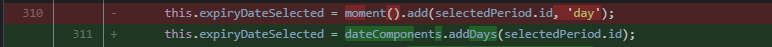
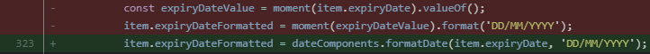

# Data Utils

Library for replacing [Moment.Js](https://momentjs.com/), which is [currently deprecated](https://stilingue-jira.atlassian.net/wiki/spaces/SCG/pages/1972207651/Plano+de+Deploy+-+Exporta+o+Relat+rio+V2).

The library has only basic functionalities, but new ones can be added easily and quickly, and the best part is that you don't need to import anything since the Date Objects themselves are being used.

---
### addDays()

 ```js
 addDays(days(int), date(DateObj))

Adds a specified number of days to the selected date. If no date is passed as a parameter, the current date is used.

Example of moment replacement:


```bash
- this.expiryDateSelected = moment().add(selectedPeriod.id, 'day');
+ this.expiryDateSelected = dateComponents.addDays(selectedPeriod.id);
```

---

### formatDate()

 ```js
 formatDate(data(DateObj), format(str))
 ```

Formats a string using regular expressions to provide the date in the desired format.
Reference: https://developer.mozilla.org/en-US/docs/Web/JavaScript/Reference/Global_Objects/Intl/DateTimeFormat/DateTimeFormat


> |    | Token                    | Output                 |
> |---------------|-----------------------------------|----------------|
> |**Month**|M|1 2 … 11 12|
> ||MM|01 02 … 11 12|
> ||MMM|*Mar.*|
> ||MMMM|*March*|
> |**Year**|YY|70 71 … 29 30|
> ||YYYY|1970 1971 … 2029 2030|
> |**Day of the month**|D|1 2 … 30 31|
> ||DD|01 02 … 30 31|
> |**Day of the week**|dd|*thu.*|
> ||ddd|*Thursday*|
> |**Hour**|H|0 1 … 22 23|
> ||HH|00 01 … 22 23|
> ||h|0 1 … 11 12|
> ||hh|00 01 … 11 12|
> |**Minute**|m|0 1 … 58 59|
> ||mm|00 01 … 58 59|
> |**Second**|s|0 1 … 58 59|
> ||ss|00 01 … 58 59|

Example of **moment** replacement:


```bash
-const expiryDateValue = moment(item.expiryDate).valueOf();
-item.expiryDateFormatted = moment(expiryDateValue).format('DD/MM/YYYY');
+item.expiryDateFormatted = dateComponents.formatDate(item.expiryDate, 'DD/MM/YYYY');
```